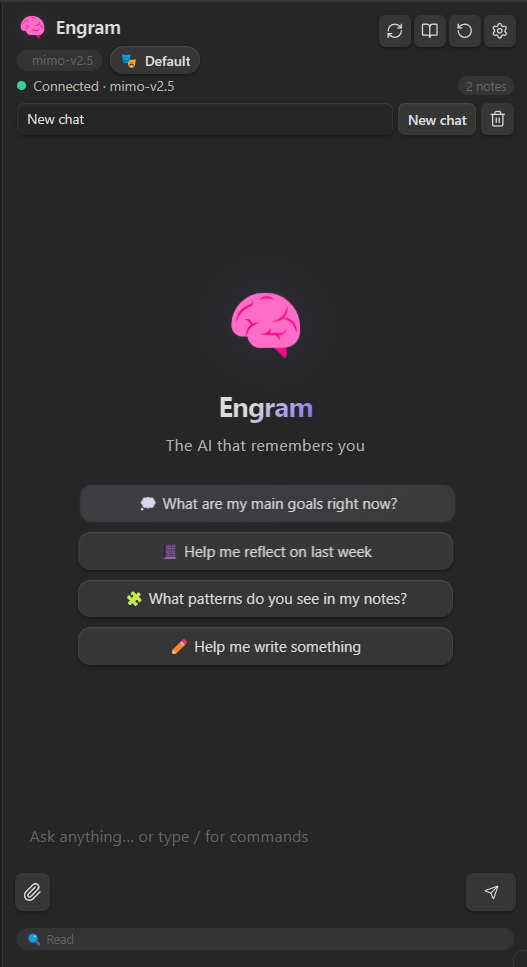

# Engram for Obsidian

> **The AI that remembers you.** A persistent personal intelligence for Obsidian with evolving memory, semantic vault search, multi-provider support, interactive slash commands, and secure, scoped vault access.

<p align="center">
  
</p>

---

## 🧠 What is Engram?

Engram transforms Obsidian's sidebar chat from a simple query assistant into a **persistent thinking partner**. By maintaining a structured, auto-summarizing memory file (`memory.md`), Engram accumulates knowledge about your projects, preferences, habits, and beliefs over time. It reasons over your vault safely using **semantic vector search**, costs pennies to run, and respects your privacy—all data stays on your machine.

---

## ✨ Key Features

### 1. Evolving Personal Memory System
- **Structured Evolving Memory:** Engram tracks your core identity, ongoing projects, habits, and life events in a dedicated, markdown-based memory file (`memory.md`).
- **Auto-Summarization:** When your memory file grows, Engram automatically condenses older entries to minimize LLM token costs without losing context.
- **Interactive Control:** Use `/memory` to prompt the AI to extract and summarize key takeaways from your current chat session, review them in a confirmation modal, and save them. Use `/forget` to open and edit your memory file at any time.

### 2. Semantic Vault Search (Vector Embeddings)
- **True Semantic Understanding:** Instead of basic keyword matching, Engram can embed all your notes as high-dimensional vectors and find conceptually related content even when exact words don't match. Ask about *"times I felt disconnected"* and it will surface journal entries mentioning numbness, dissociation, or withdrawal.
- **Multi-Provider Embedding Support:** Works with any embedding model via:
  - **Ollama** (local, free) — e.g. `nomic-embed-text`, `mxbai-embed-large`
  - **OpenAI** — e.g. `text-embedding-3-small`
  - **Custom / llama.cpp** — point it at any OpenAI-compatible `/v1/embeddings` endpoint
- **Manual Index Control:** A dedicated **"Index Vault"** button in Settings lets you trigger indexing on demand. A progress bar shows files indexed in real time.
- **Auto-Attached Context UI:** When semantic search is used, the matched notes are shown as clickable chips directly under your message bubble — so you can always see *which* notes were injected into the AI's context.
- **Smart Cache Invalidation:** If you change your embedding model, provider, or URL, Engram automatically discards old vectors and re-indexes cleanly.
- **Persistent Storage:** Embeddings are stored in `.obsidian/plugins/engram-chat/data.json` inside your vault. They survive plugin reloads and Obsidian restarts.

### 3. Multi-Provider LLM Compatibility
Engram supports all major local and cloud LLM providers out of the box:
- **Cloud Providers:** Anthropic Claude, OpenAI (GPT series), Google Gemini (Pro / Flash), DeepSeek (V4-Pro / R1), Xiaomi MiMo, Z.ai (GLM), Mistral, Groq, and xAI.
- **Local Models:** Ollama, LM Studio, and llama.cpp (fully capable of running models like Llama 4, Qwen3, and Gemma with local tool-calling).
- **Aggregators:** OpenRouter (one API key for 100+ models).
- **CORS-Safe Architecture:** Uses Obsidian's native request APIs to bypass CORS blocks for cloud integrations, and fully supports SSE-based text streaming.

### 4. Granular Vault Scoping & Safety
- **Knowledge Scopes:** Restrict the AI to specific directories using **Allowlists** or **Denylists**. Files in private folders are fully excluded from indexing, searches, and context injection.
- **Interactive Permissions Badge:** Toggle permissions directly in the chat footer with a single click:
  - `🔍 Read` — Read-only access (safe browsing).
  - `✏️ Append` — AI can only append details to the end of notes.
  - `⚠️ Full Edit` — Full modification, creation, and deletion capabilities.
- **Destructive Protections:** Shows a real Obsidian confirmation modal before the AI can overwrite notes, create files, or delete items.

### 5. Premium, Modern User Interface
- **Slash Commands & Mentions:** Type `/` to select commands or `@` to autocomplete note names as context links.
- **Token Budget Bar:** A color-coded progress bar in the footer showing active token usage against your provider's context window.
- **Dynamic Welcome Chips:** Prompts you with suggestions based on your most recently edited notes or top vault tags.
- **Undo History Panel:** Review and selectively undo any file creation, append, or overwrite operation performed by the AI.

### 6. Local Offline PDF Attachment Parsing
- Drag and drop or attach a PDF.
- Select a page range (e.g. page 1–3) using an interactive popup.
- Engram converts and extracts pages **locally** into images using a built-in PDF.js worker — no external servers, 100% offline.

---

## 🚀 Installation

### Option 1: Via BRAT (Recommended)
1. Install the **BRAT (Beta Reviewer's Auto-update Tool)** plugin from Obsidian's community store.
2. In Obsidian Settings, go to **Beta Reviewer's Auto-update Tool**.
3. Click **Add Beta plugin** and paste this repository URL:
   `https://github.com/PixelAnay/Engram`
4. Enable **Engram** under Community Plugins.

### Option 2: Manual Installation
1. Go to the [Releases](https://github.com/PixelAnay/Engram/releases) tab.
2. Download `main.js`, `manifest.json`, and `styles.css`.
3. Create a folder named `engram-chat` inside your vault's plugins folder:
   `<VaultPath>/.obsidian/plugins/engram-chat/`
4. Copy the downloaded files into that directory.
5. Reload Obsidian and enable the plugin.

---

## 🔍 Setting Up Semantic Search (Embeddings)

Semantic search lets Engram understand the *meaning* of your notes rather than just searching for exact words. This is the most powerful way to use Engram with a large vault.

### Step 1: Choose an Embedding Provider

#### Option A — Ollama (Easiest, Free, Local)

1. Install [Ollama](https://ollama.com) and pull an embedding model:
   ```bash
   ollama pull nomic-embed-text
   ```
2. Ollama runs a local server at `http://localhost:11434` by default.

#### Option B — llama.cpp (Custom GPU, Maximum Control)

1. Download a GGUF embedding model (e.g. `Qwen3-Embedding-4B-Q8_0.gguf`).
2. Start llama.cpp server in **embedding mode**:
   ```bash
   # Windows — run from the folder containing llama-server.exe
   .\llama-server.exe -m "C:\path\to\model.gguf" --port 8080 --embedding
   ```
   > **Note:** Use `llama-server.exe`, not `llama-server` (no `.exe` causes a "not recognized" error on Windows PowerShell).
3. Verify the server is up by visiting `http://localhost:8080/v1/models` in your browser.

#### Option C — OpenAI

Use `text-embedding-3-small` or `text-embedding-ada-002` with your OpenAI API key.

---

### Step 2: Configure Engram

Open Obsidian → **Settings** → **Engram** → **Semantic Search (Embeddings)** section:

| Setting | Value |
|---|---|
| **Provider** | `Ollama`, `OpenAI`, or `Custom (llama.cpp / compatible)` |
| **Model Name** | e.g. `nomic-embed-text` or `Qwen3-Embedding-4B` |
| **Base URL** | e.g. `http://localhost:11434` (Ollama) or `http://localhost:8080` (llama.cpp) |
| **API Key** | Only needed for OpenAI |

> ⚠️ **Important:** If the Base URL is wrong or the server isn't running, Engram will show an error when you try to index. The "Index Vault" button will not silently succeed.

---

### Step 3: Index Your Vault

1. In Engram Settings, click **"Index Vault"**.
2. A progress bar appears showing files being embedded in real time.
3. When complete, you'll see a confirmation notice (e.g. *"Indexed 349 files"*).
4. Embeddings are saved automatically to `data.json` in the plugin folder.

> **Re-indexing:** If you add many new notes or change your embedding model, click **"Index Vault"** again. Engram detects model/URL changes automatically and discards stale vectors.

---

### Step 4: Use It

Just chat normally. When you ask a question, Engram:
1. Embeds your query using the same model.
2. Runs a cosine-similarity search across all indexed notes.
3. Injects the top matches into the AI's context as `[VAULT DATA]`.
4. Shows matched note names as **clickable chips** under your message bubble.

You don't need to do anything special — semantic search is automatic when the index is ready.

---

## 🛠️ Usage & Commands

- **Ribbon Icon:** Click the Brain icon 🧠 in the left ribbon to open the chat sidebar.
- **Slash Commands:**
  - `/memory` — Extract and save notes/facts from the current conversation.
  - `/forget` — Open the active memory file to prune or view entries.
  - `/persona [name]` — Switch between configured LLM personas.
  - `/export` — Save the active chat session to a Markdown file.
  - `/clear` — Clear the current session.
  - `/scope` — Display the folders the AI currently has permission to read.
- **Command Palette:**
  - `Open Engram sidebar`
  - `Engram: Re-index vault`
  - `Engram: Open memory file`

---

## 🔒 Security Hardening

- **Sandbox Boundaries:** Note content is wrapped in strict `[VAULT DATA START]` and `[VAULT DATA END]` markers inside the LLM prompt. The system instructions mandate that the AI treat everything inside these boundaries strictly as data rather than instructions, mitigating prompt injection attacks.
- **Key Security:** API keys are excluded from `data.json` and are not synced with Git, Obsidian Sync, or iCloud.

---

## 🐛 Troubleshooting

### "It says indexing done even with a wrong URL"
- This was a bug fixed in v5.0.26. Engram now validates the embedding server connection before accepting any indexing result. Errors are surfaced immediately in the UI.

### "The AI says it didn't use semantic search"
- Confirm the index is ready: go to Settings → Engram and check if the indexed file count is shown.
- Verify your embedding server is still running (it must be running at chat time, not just at index time).
- Check the `[VAULT DATA]` block: the AI *does* have the context but may not explicitly say so. Look for the **auto-attached note chips** under your message bubble instead.

### "llama-server is not recognized" (Windows)
- Make sure you are running `llama-server.exe` (with the `.exe` extension).
- Run the command from the directory that contains the executable, or add it to your system `PATH`.
- Example: `cd C:\llama.cpp\build\bin && .\llama-server.exe -m model.gguf --port 8080 --embedding`

### "model output error: model output must contain either output text or tool calls"
- This error comes from the LLM provider when the model returns an empty response.
- Try switching to a different model or reducing the complexity of your query.
- If using a local model, ensure it is fully loaded and not running out of VRAM.

### Embeddings are lost after restarting
- Embeddings persist in `data.json` — they should survive restarts. If they are gone, the model/URL config may have changed, triggering automatic cache invalidation. Re-index once to rebuild.

---

## 💻 Development

If you want to build the plugin from source:

1. Clone this repository:
   ```bash
   git clone https://github.com/PixelAnay/Engram.git
   ```
2. Install dependencies:
   ```bash
   npm install
   ```
3. Build the production bundle:
   ```bash
   npm run build
   ```
4. Sync to your development vault by setting your vault path:
   ```powershell
   # Windows (PowerShell)
   setx OBSIDIAN_VAULT_PATH "C:\Path\To\Your\Vault"
   ```
   Then run:
   ```bash
   npm run deploy
   ```

---

## 📄 License

MIT License. See [LICENSE](LICENSE) for details.
